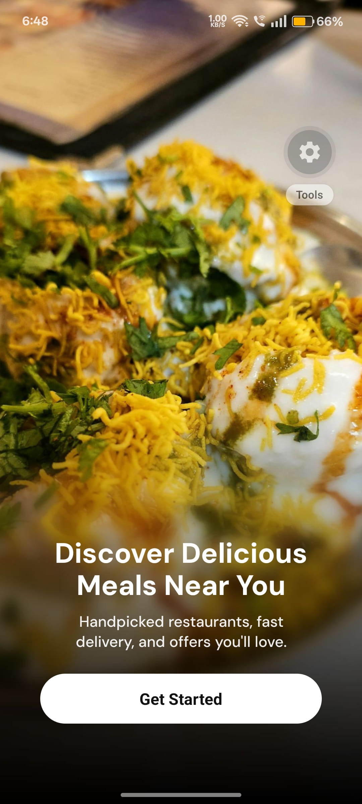
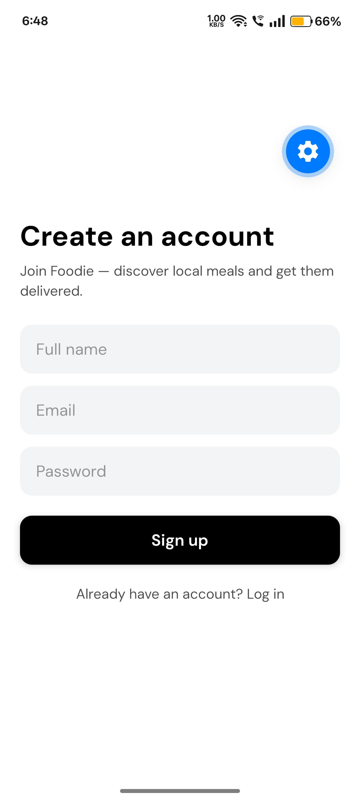
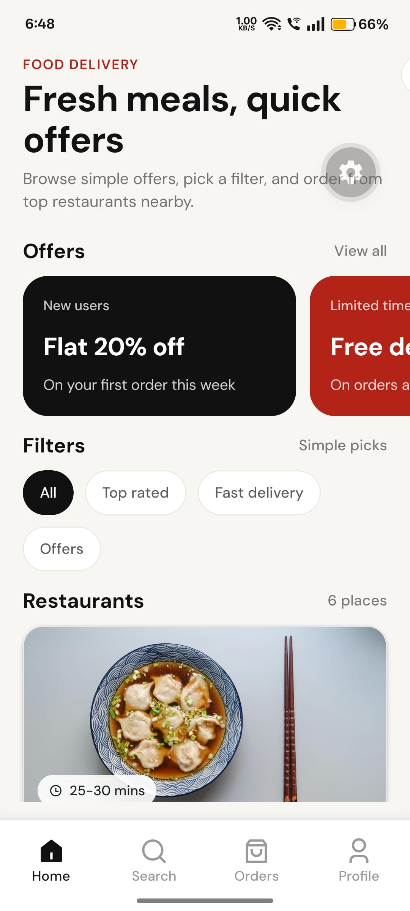

## Screenshots & Preview

Preview images and a short demo video are included in the project assets: ../assets/preview

<!-- Embedded preview video -->

[<video src="../assets/preview/preview.mp4" controls width="360"></video>](https://github.com/user-attachments/assets/af978115-f5ff-4fae-a9ee-075d42b9c2ba)

<!-- Primary screenshots -->




<!--  -->
<!--  -->
<!--  -->

More previews and the full demo video are available in the preview folder: ../assets/preview

[See more previews →](../assets/preview)

## Project overview

This is a small, production-like food delivery mobile app built with Expo and React Native. It demonstrates a multi-screen shopping flow including onboarding, browsing restaurants, restaurant detail, cart, order confirmation, user profile, settings and help screens. The app uses modern navigation patterns (stack, bottom tabs, and a user drawer) and supports deep linking for key screens.

## Tech stack

- **Framework:** Expo
- **Runtime:** React Native
- **Language:** TypeScript
- **Navigation:** React Navigation (`@react-navigation/native`, bottom-tabs, native-stack, drawer)
- **Other:** `expo-linking`, `expo-font`, `expo-splash-screen`, `react-native-reanimated`, `react-native-gesture-handler`

Dependencies are declared in the project `package.json` at the project root.

## How to run locally

Prerequisites:

- Node.js
- Yarn or npm
- Expo CLI (optional but recommended)

Install and run:

```bash
cd food-delivery-app
npm install
# or: yarn

# Start Expo
npm run start
# then press 'a' to open Android, 'i' for iOS simulator, or scan the QR code for a physical device
```

If you prefer the Expo CLI binary instead of npm scripts:

```bash
npx expo start
```

Testing deep links locally (see Deep linking setup below) can be done with `npx uri-scheme` or `adb shell` (Android) pointing to the prefixes listed in the linking config.

## Navigation structure

High-level routing in the app:

- Root: `StackNavigator` (defined at `src/navigator/stack/StackNavigator.tsx`)
    - `Onboarding` — `OnboardingScreen`
    - `MainTabs` — `TabsNavigator` (bottom tabs)
    - `RestaurantDetailScreen` — restaurant detail screen (stack push)
    - `Cart` — cart screen
    - `OrderConfirmation` — order confirmation screen
    - `Login` — sign-up / login screen

- `TabsNavigator` (defined at `src/navigator/tabs/TabsNavigator.tsx`)
    - `Home` — `HomeScreen`
    - `Search` — `SearchScreen`
    - `Orders` — `OrdersScreen` (shows tab badge for order count)
    - `Profile` — opens `ProfileDrawerNavigator` (drawer nested)

- `ProfileDrawerNavigator` (defined at `src/navigator/drawer/ProfileDrawerNavigator.tsx`)
    - `ProfileHome` — `ProfileScreen`
    - `Settings` — `SettingsScreen`
    - `Help` — `HelpScreen`

This layout keeps onboarding and deep-linked screens on the root stack, the main app UI behind a tab navigator, and user-specific screens inside a right-side drawer.

## Deep linking setup

Deep linking is configured inside `StackNavigator` (`src/navigator/stack/StackNavigator.tsx`). Key points:

- Prefixes:
    - Expo generated URL: `Linking.createURL("/")`
    - Custom scheme: `foodapp://`
- Configured screens and paths:
    - `Onboarding` -> `onboarding`
    - `MainTabs` -> `tabs`
    - `RestaurantDetailScreen` -> `restaurant/:restaurantId` (parses `restaurantId` as Number)
    - `Cart` -> `cart`
    - `OrderConfirmation` -> `order-confirmation`
    - `Login` -> `login`

Examples:

- Expo (tunnel) URL example (replace with your local expo URL):
    - `exp://192.0.2.1:19000/--/restaurant/42`
- Custom scheme:
    - `foodapp://restaurant/42`

How to test (quick):

- On Android emulator with adb:

```bash
adb shell am start -a android.intent.action.VIEW -d "foodapp://restaurant/42" com.your.app.package
```

- With `npx uri-scheme` (install if necessary):

```bash
npx uri-scheme open foodapp://restaurant/42 --android
```

Note: replace package identifiers and host addresses as appropriate for your environment. When testing via Expo, use the Expo-provided URL as the prefix.

## Assumptions made

- The project is an Expo-managed workflow app (see `package.json` and `expo` dependency).
- Navigation state and deep linking are handled by `src/navigator/stack/StackNavigator.tsx` and use the `foodapp://` scheme plus the Expo URL prefix.
- The assets for screenshots and preview live at `../assets/preview` relative to this README.
- No backend integration is required for local testing; data shown in the app is provided by local constants and mock data (`src/constants`).
- Onboarding is shown as the initial route before `MainTabs`.

## Where to look next

- App entry: `App.tsx` and `index.ts`
- Screens: `src/screens/`
- Navigation: `src/navigator/`
- Constants and sample data: `src/constants/`

If you'd like, I can also:

- Add an example deep-linking quicktest script
- Create a short README at the project root linking to this file and the demo assets

---
