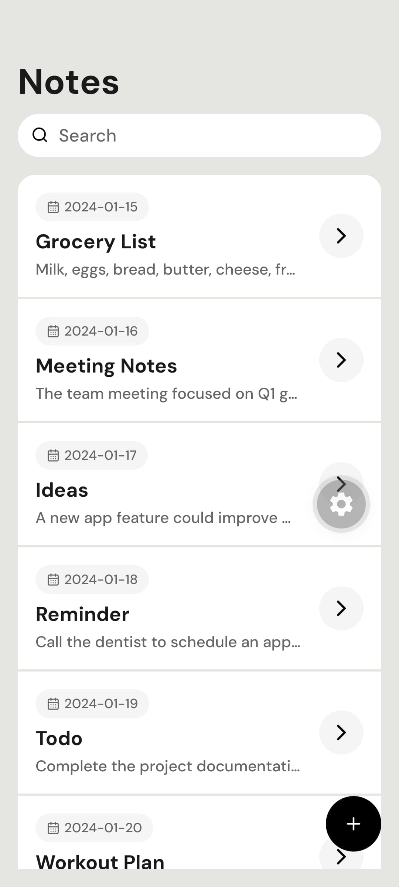
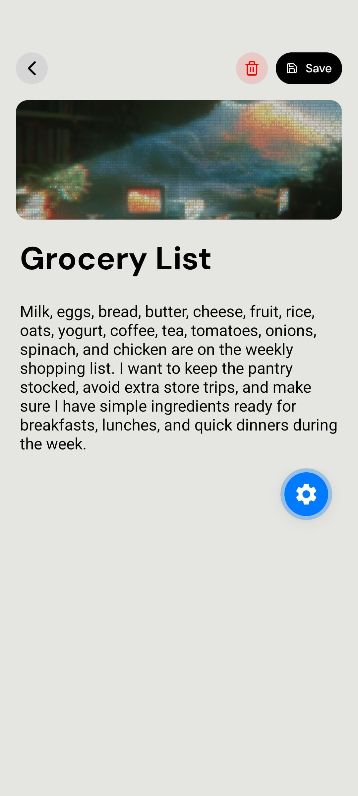
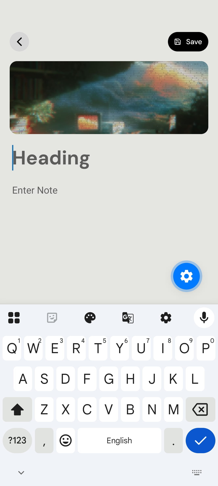
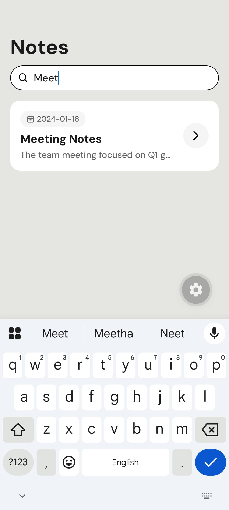

# Notes App Screens

React Native (Expo + TypeScript) project for a notes app UI flow.

## Preview Video

[<video src="./assets/preview/preview.mp4" controls width="360"></video>](https://github.com/user-attachments/assets/43c22450-5823-4aec-9935-73aa9e0e7a6f)

If your Markdown viewer does not render embedded video, open it directly:
[Watch preview video](./assets/preview/preview.mp4)

## Preview Images






## Features

- Notes list screen
- Add note screen
- Note details screen
- Expo Router file-based navigation
- Theme support setup

## Tech Stack

- Expo
- React Native
- TypeScript
- Expo Router

## Project Structure

```text
src/
   app/
      _layout.tsx
      index.tsx
      add-notes.tsx
      [noteId].tsx
   constants/
      notes.ts
```

## Run Locally

1. Install dependencies:

```bash
npm install
```

2. Start development server:

```bash
npx expo start
```

3. Open in Expo Go / Android Emulator / iOS Simulator.
