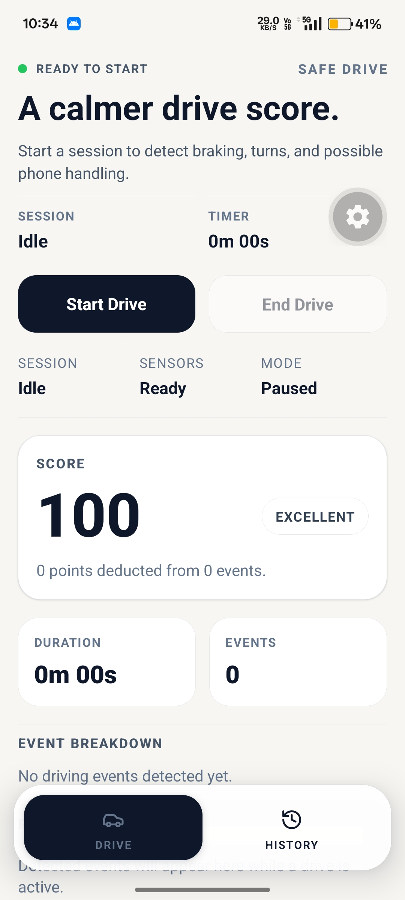
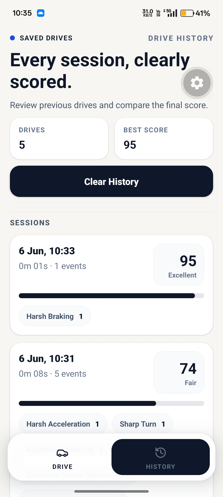

# Safe Drive

Safe Drive is a sensor-based driving companion built with Expo and React Native. It listens to motion sensors during a drive, flags events such as harsh braking or aggressive steering, and turns those detections into a simple driving score and session history.

## Project Overview

The app is organized around two main screens:

- The drive screen starts and stops a live sensor session, detects driving events in real time, and shows the current score.
- The history screen saves completed sessions locally and lets you review previous scores and event breakdowns.

Sessions are stored on-device with AsyncStorage, so history remains available after the app restarts.

## Screenshots and Preview

The visual previews live in the assets folder.

[<video src="./assets/preview/preview.mp4" controls width="360"></video>](https://github.com/user-attachments/assets/f0c73581-bfb5-4abe-a5f7-68398dd8ea0f)
Preview video: [assets/preview/preview.mp4](assets/preview/preview.mp4)




## Tech Stack Used

- Expo 56
- React Native 0.85
- React 19
- TypeScript
- Expo Router for file-based navigation
- expo-sensors for accelerometer, gyroscope, device motion, and magnetometer input
- @react-native-async-storage/async-storage for local history persistence
- react-native-safe-area-context for layout padding and safe areas
- react-native-reanimated and react-native-gesture-handler for the Expo runtime stack
- lucide-react-native and @expo/vector-icons for icons

## Sensors Used

- Accelerometer: used as a fallback motion source and for linear acceleration checks.
- Device Motion: used for linear acceleration, acceleration including gravity, and rotation rate.
- Gyroscope: used for rotation magnitude and turn detection.
- Magnetometer: collected when available, but treated as optional.

The app checks sensor availability before starting a session and requests permissions when a drive begins.

## Event Detection Strategy

The detection logic is implemented in `src/lib/driving.ts` and runs on the latest combined sensor sample.

1. The first sensor sample primes the detector and does not generate events.
2. Incoming readings from different sensors are merged into a single `SensorSample` object.
3. Each sample is evaluated against a small set of heuristic rules.
4. Detected events are rate-limited with cooldowns so the same event does not spam the session timeline.
5. Event severity is attached at detection time and later used to calculate the driving score.

Update cadence:

- Accelerometer, gyroscope, and device motion are sampled every 80 ms while a drive is active.
- Magnetometer, when available, is sampled every 120 ms.

Cooldowns:

- Most events use a 900 ms cooldown.
- Possible Phone Handling uses a 1800 ms cooldown.

## Threshold Values Chosen

These are the current thresholds used by the detector:

- Harsh Braking: forward-axis deceleration below -3.6 m/s², or gravity-adjusted forward acceleration below -4.0.
- Harsh Acceleration: forward-axis acceleration above 3.6 m/s², or gravity-adjusted forward acceleration above 4.0.
- Sharp Turn: yaw rotation above 2.3 rad/s, or device-motion alpha above 140.
- Aggressive Steering: combined rotation magnitude above 3.0 rad/s, or X/Y rotation above 1.9 rad/s.
- Excessive Device Movement: linear acceleration magnitude above 1.75g, or gravity magnitude above 12.0.
- Possible Phone Handling: rotation magnitude above 4.1 rad/s while linear acceleration stays below 1.5.

These values are heuristic, not model-trained. They were chosen to balance obvious driving maneuvers with a small amount of noise tolerance from handheld sensors.

## Driving Score Calculation Logic

The score is session-based and starts at 100.

- Every detected event contributes a fixed deduction stored in the event rules.
- Total deductions are summed across the session.
- Final score = `max(0, 100 - total deductions)`.
- The score is mapped to a text rating:
    - 95 to 100: Excellent
    - 85 to 94: Very Good
    - 75 to 84: Good
    - 60 to 74: Fair
    - 40 to 59: Risky
    - 0 to 39: Unsafe

Current deduction values:

- Harsh Braking: 5
- Harsh Acceleration: 5
- Sharp Turn: 3
- Aggressive Steering: 4
- Excessive Device Movement: 4
- Possible Phone Handling: 10

## How to Run Locally

1. Install dependencies:

    ```bash
    npm install
    ```

2. Start the Expo dev server:

    ```bash
    npx expo start
    ```

3. Open the app on a physical device or simulator from the Expo dev tools.

Notes:

- Sensor-driven features work best on a physical device.
- If you want to inspect the web version, run `npm run web`.

## Assumptions Made

- The phone is mounted or held in a relatively consistent orientation during the drive.
- Sensor readings are good enough to approximate driving behavior without calibration.
- Sessions are started and stopped manually by the user.
- Local storage is sufficient for history; no backend sync is required.
- The thresholds are intentionally heuristic and may need tuning for different vehicles, mounting positions, or driving styles.
- A single device is the source of truth for a drive session; there is no multi-device correlation.

## Repo Structure

- `src/app`: Expo Router screens and layout.
- `src/lib/driving.ts`: sensor fusion, event detection, scoring, and session record helpers.
- `src/lib/drive-history.tsx`: local history storage and retrieval.
- `assets/preview`: screenshots and the preview video used in this README.

## License

See [LICENSE](LICENSE) for details.
