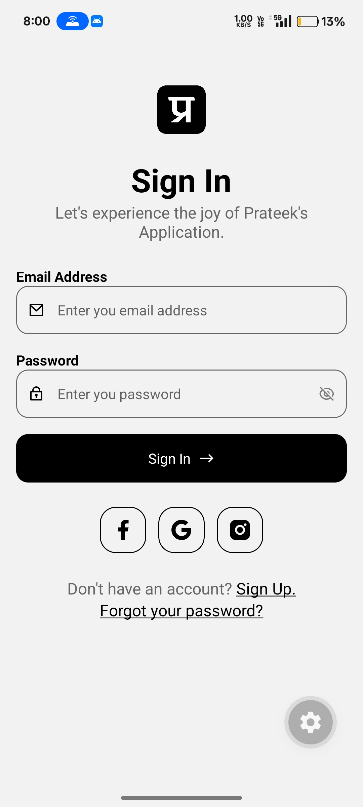

# Sign-In Screen (Expo + React Native)

This repository contains a small Expo-based React Native app demonstrating a clean, responsive sign-in screen.

## Preview



## Features

- Simple email/password sign-in UI
- Input validation and error states
- Accessible layout that adapts across device sizes

## Quick start

1. Install dependencies

```bash
npm install
```

2. Start the Expo dev server

```bash
npx expo start
```

3. Open on device or emulator using the Expo dev tools (QR or emulator options).

## Where to find the sign-in screen

- The screen component lives in the `app` directory — start by inspecting `app/index.tsx` and `app/_layout.tsx`.
- Assets (icons and preview) are in `assets/` — the preview shown above is `assets/preview.jpg`.

## Usage notes

- To replace the preview image, swap `assets/preview.jpg` with your image (keep the same filename).
- The screen is written with Expo's default configs and TypeScript support enabled.

## File structure (relevant)

- `app/` — app routes and UI entry points
- `assets/` — images and icons (includes `preview.jpg`)
- `package.json` — scripts and dependencies

## Run scripts

- `npm start` / `npx expo start` — start dev server
- `npm run android` — open Android emulator (if configured)
- `npm run ios` — open iOS simulator (macOS only)

## Feedback and next steps

If you'd like, I can:

- Add a small storybook or playground for the sign-in component
- Implement form submission + mock authentication
- Create variants (social sign-in, forgot-password flow)

---

Created for the Mobile Dev Cohort sign-in screen project.
