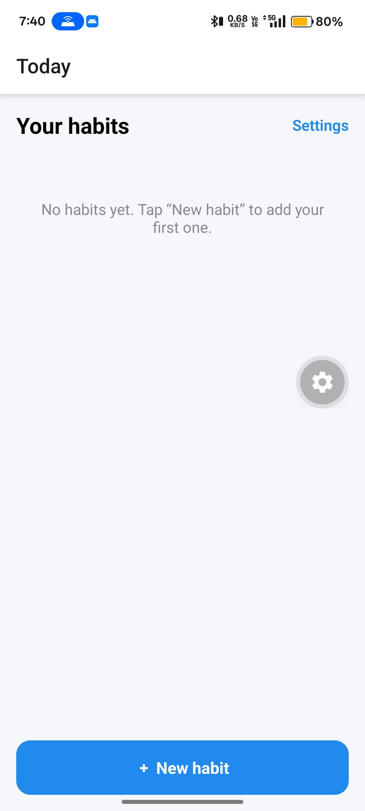
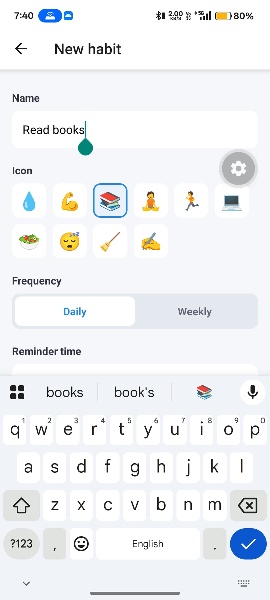
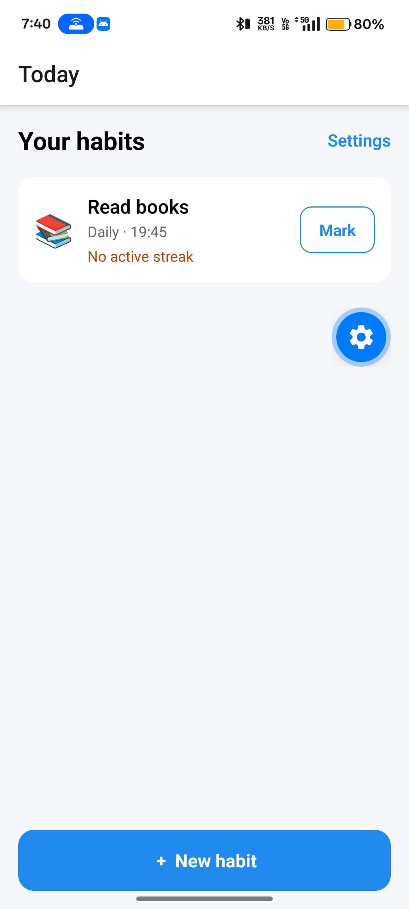
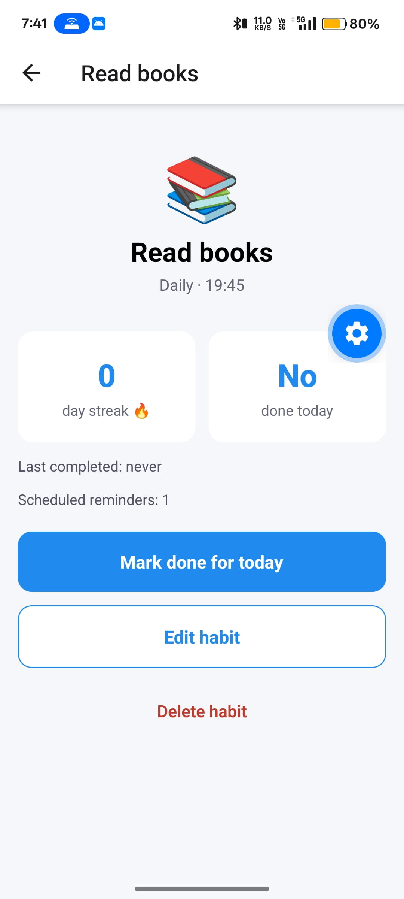
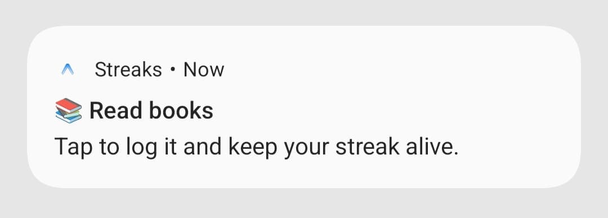

# 🔥 Streaks — Habit Tracker

A simple habit tracker built with **Expo (SDK 56)** and **expo-router**. Create habits, get **local reminders**, and keep your streak alive.

## Preview

[<video src="assets/preview/preview.mp4" width="320" controls></video>](https://github.com/user-attachments/assets/3091c04a-b059-4747-bafd-ec3e37c29825)

> ▶️ [Watch the demo video](assets/preview/preview.mp4)

<p>

  
  
  
  
  </p>

## Features

- Create, edit, and delete habits (name, emoji, reminder time, frequency)
- **Daily** or **weekly** (selected weekdays) local reminders
- Streaks: completing today keeps it going, a missed day resets it
- Tap a reminder to deep-link straight to that habit
- Reactive permission handling with a denied-state + open-settings option
- Persists across restarts (AsyncStorage) and cancels/reschedules per-habit notifications

## Getting started

```bash
npm install
npx expo start
```

Open on a **real device** — reminders schedule on simulators but only actually fire on hardware.

## Project structure

```
src/
  app/         # screens: index, new, settings, habit/[id]
  hooks/       # use-habits, use-notifications, use-notification-router
  lib/
    habits/    # types, storage (AsyncStorage), streak logic
    notifications/  # setup (handler + Android channel + permissions), schedule
```

All notification side effects live in `src/lib/notifications` and are exposed through hooks.
